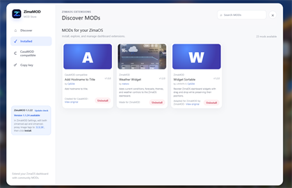

# ZimaMOD

<p align="center">
  
</p>

Independent, community-developed mod framework for ZimaOS.

> **Independent community project:** ZimaMOD is not affiliated with, endorsed
> by, maintained by, or supported by the ZimaOS, CasaOS, or CasaMOD projects or
> their respective teams.

> **Warning:** Mods, including mods available through the MOD Store, must not be
> assumed to be verified, audited, safe, or compatible with your system. Review
> and trust a mod's source code before installing it. ZimaMOD and its mods are
> provided **as is**, without warranty. You use them entirely at your own risk,
> and the project maintainers and contributors accept no responsibility or
> liability for data loss, security incidents, service disruption, system
> damage, or any other consequences resulting from their use.

ZimaOS uses the CasaOS design language and APIs, but its dashboard is served by
`zimaos-gateway` from embedded assets. It does not expose the editable
dashboard files expected by traditional host-patching mod systems.

ZimaMOD solves this with a reverse proxy and a small compatibility API:

```text
Browser
  -> ZimaMOD proxy :8088 (configurable)
     -> ZimaOS gateway :80
     -> ZimaMOD API :8090 (configurable)
```

## Features

- Injects one stable compatibility loader into the ZimaOS dashboard.
- Discovers enabled mods dynamically from `/DATA/AppData/zimamod/mod`.
- Serves mod JavaScript, CSS, icons, and other assets with correct MIME types.
- Stores per-mod JSON configuration under `/DATA/AppData/zimamod/config`.
- Avoids execution inside ZimaOS Wujie micro-apps, shadow roots, and iframes.
- Includes a bundled MOD Store catalog of native ZimaMOD, adapted CasaMOD, and
  tested CasaMOD-compatible mods. Bundled mods are available to install but are
  not installed automatically.
- Includes ZimaOS custom-app metadata and a dedicated ZimaMOD app icon.
- Includes a dashboard MOD Store for installing and uninstalling catalog mods.
- Shows an update indicator and installation guidance when a newer ZimaMOD
  release is available.

## Screenshots

Click a thumbnail to view the full-resolution screenshot.

<table>
  <tr>
    <td align="center">
      <a href="screenshots/zimamod-dashboard.png">
        
      </a><br>
      <sub>ZimaMOD dashboard</sub>
    </td>
    <td align="center">
      <a href="screenshots/mod-store-discover.png">
        
      </a><br>
      <sub>MOD Store Discover</sub>
    </td>
    <td align="center">
      <a href="screenshots/mod-store-installed.png">
        
      </a><br>
      <sub>MOD Store Installed</sub>
    </td>
  </tr>
</table>

## Container Images

The app uses two ZimaMOD images:

```text
ghcr.io/metisro/zimamod-api:latest
ghcr.io/metisro/zimamod-proxy:latest
```

Releases also publish immutable semantic-version tags, such as:

```text
ghcr.io/metisro/zimamod-api:1.1.28
ghcr.io/metisro/zimamod-proxy:1.1.28
```

They are built from this GitHub repository. Their upstream Docker Official
Images are `node:22-alpine` and `nginx:alpine`.

The GitHub Actions workflow at `.github/workflows/publish-docker.yml` publishes
both images to GitHub Container Registry for `linux/amd64` and `linux/arm64`.
It uses the repository's built-in `GITHUB_TOKEN`; no registry secret is needed.

Before publishing any images, the workflow runs the API and runtime tests and
checks the syntax of every JavaScript file under `api/`, `runtime/`, and
`mods/`. Pull requests run the same checks through `.github/workflows/ci.yml`.
Branch pushes publish `latest` and commit-SHA tags after validation. Release
tags additionally publish the matching version tag and create a GitHub Release.

## Docker Compose Install

Download `docker-compose.yml` from GitHub or import it as a custom Compose app,
then run:

```sh
docker compose up -d
chmod +x verify.sh
./verify.sh
```

Each time `zimamod-api` starts, it generates a new random write token at:

```text
/DATA/AppData/zimamod/config/api_token
```

Open the MOD Store and click **Copy key** in the left column, then paste it
when the first install, uninstall, or configuration write requests
authorization. The valid token is kept in that tab's session storage, so it is
requested only once per browser session.

**Copy key** requires a valid signed-in ZimaOS dashboard session. ZimaMOD
validates that session before returning the current key.

Restarting `zimamod-api` rotates the token and invalidates previously authorized
browser sessions. Read-only dashboard API requests do not require a token.

The default dashboard connection uses HTTP, so the bearer token is not
protected from a network attacker capable of intercepting LAN traffic. Put
ZimaMOD behind HTTPS before using it across an untrusted network.

This authorization boundary protects mutating API routes from unauthenticated
LAN clients and cross-site requests. It does not sandbox installed mods:
enabled mods execute in the dashboard origin and must still be trusted. Config
reads remain unauthenticated so enabled mods can load settings at startup.

The install Compose file pins both images and `x-casaos.version` to the latest
published semantic release. It is intentionally not advanced to a development
version until both matching GHCR image tags exist. This lets ZimaOS display the
installed version, provides reliable app-store update comparisons, and keeps
the documented installation usable between releases. The publishing workflow
also updates `:latest` for users who prefer manually tracking the newest build.

ZimaOS can automatically offer future versions only when ZimaMOD is installed
from an app-store source that tracks this manifest. A one-time custom Compose
import displays the version but must be re-imported or rebuilt manually when a
new manifest is released.

When updating an existing custom Compose installation, use the latest complete
`docker-compose.yml`. Updating only image tags does not apply newly introduced
volumes or environment variables. ZimaMOD `1.1.27` adds the following API
volume for Bing Wallpaper saves:

```yaml
- /DATA/Gallery/Bing Wallpapers:/gallery
```

### Creating A Release

`VERSION` identifies the source version being prepared. The install Compose
image tags, top-level version, and `x-casaos.version` identify the latest
published release and may remain one version behind during development.

To publish a release, first update `VERSION` and the versioned runtime assets,
commit the change, then create and push a matching `v<version>` Git tag:

```sh
git tag v1.1.28
git push origin v1.1.28
```

The tag publishes immutable `:<version>` API and proxy images and creates a
GitHub Release. After that workflow succeeds, update the install Compose image
tags and version fields to the newly published version. Normal pushes to `main`
update only `:latest` and commit-SHA image tags.

No source checkout, host installation script, or manual mod copying is required
on ZimaOS. `install.sh` remains as a convenience wrapper around
`docker compose up -d`.

### Local Image Build

Developers can build the images directly from the GitHub source checkout:

```sh
docker compose -f docker-compose.build.yml up -d --build
```

Open:

```text
http://ZIMAOS-IP:8088
```

The standard ZimaOS dashboard remains available on port `80`.

### ZimaOS Settings

When importing through ZimaOS, the API automatically generates its write token
in `/DATA/AppData/zimamod/config/api_token`. Use the MOD Store's **Copy key**
button, or retrieve it from the ZimaOS terminal:

```sh
docker exec zimamod-api cat /data/config/api_token
```

The token changes whenever `zimamod-api` restarts.

The import Compose file uses literal default port values so ZimaOS displays
`8088` and `8090` correctly during import. A new installation starts with no
mods installed; choose each desired mod from the MOD Store.

### Custom Ports

ZimaMOD defaults to dashboard port `8088` and private API port `8090`. Both can
be changed at runtime without rebuilding either image. For Docker Compose,
edit the environment values in `docker-compose.yml` before recreating the
containers:

```yaml
zimamod-api:
  environment:
    ZIMAMOD_API_PORT: "8190"
zimamod-proxy:
  environment:
    ZIMAMOD_DASHBOARD_PORT: "8188"
    ZIMAMOD_API_PORT: "8190"
```

```sh
docker compose up -d --force-recreate
```

When editing the app through ZimaOS Settings, configure each service tab
separately. For example, to use dashboard port `8199` and API port `8191`:

1. Open the **zimamod-api** tab and add:

   ```text
   ZIMAMOD_API_PORT=8191
   ```

2. Open the **zimamod-proxy** tab and add:

   ```text
   ZIMAMOD_DASHBOARD_PORT=8199
   ZIMAMOD_API_PORT=8191
   ```

3. Change the app's **Web UI** port to `8199`, then save the app.

Environment-variable keys are whitespace-sensitive. Enter the keys exactly as
shown, without leading or trailing spaces. In particular,
` ZIMAMOD_API_PORT` is not the same variable as `ZIMAMOD_API_PORT`.

The API port must be identical on both service tabs. The dashboard port is only
required on `zimamod-proxy`. Existing installations may also show the legacy
`PORT=8090` variable on `zimamod-api`; it can be removed after
`ZIMAMOD_API_PORT` is configured.

Valid port values are integers from `1` through `65535`. The default values
remain suitable for most installations. The dashboard and API ports must be
different.

After saving, verify the running configuration from the ZimaOS terminal:

```sh
docker inspect zimamod-api --format '{{json .Config.Env}}'
docker inspect zimamod-proxy --format '{{json .Config.Env}}'
docker exec zimamod-proxy grep -E 'listen|proxy_pass' /etc/nginx/nginx.conf
curl -i http://127.0.0.1:8191/mods
curl -i http://127.0.0.1:8199/zimamod-api/mods
```

For the example above, Nginx must listen on `8199` and its `/zimamod-api/`
upstream must use `127.0.0.1:8191`. Both curl requests should return
`HTTP/1.1 200 OK`.

If the API repeatedly restarts with `EADDRINUSE`, check for another container
or process already using the selected port:

```sh
ss -ltnp | grep -E ':8191|:8199'
docker ps --format 'table {{.Names}}\t{{.Status}}\t{{.Ports}}'
```

Remove only a confirmed stale duplicate ZimaMOD container, or choose an unused
port and apply it consistently to both service tabs.

## Update Notifications

ZimaMOD checks the latest GitHub Release through its local API after dashboard
load and every eight hours. The API caches both successful and unavailable
checks, limiting automatic GitHub requests to approximately three per day per
installation. The MOD Store includes a manual **Update check** action.

When an update is available, a blue dot appears on the ZimaMOD dashboard tile
and the MOD Store displays the installed and latest versions with instructions
for applying the latest Compose manifest or matching image, volume, and
environment changes in ZimaOS Settings. ZimaMOD never installs framework
updates automatically.

## Directories

```text
/DATA/AppData/zimamod/
  mod/                    installed mods
  config/                 persistent per-mod settings
  store/                  mods available through the MOD Store
/DATA/Gallery/Bing Wallpapers/
  Saved Bing Wallpaper images
```

These directories are mounted into the containers. Starting or rebuilding the
API refreshes the bundled MOD Store catalog without installing catalog entries,
deleting installed mods, or changing persistent settings.

For complete uninstall, rollback, backup, and recovery procedures, see the
[operations guide](docs/OPERATIONS.md).

Hover over the ZimaMOD app tile on the dashboard and select **MOD Store** to
view the catalog. Installing copies a catalog mod from `store/<mod-id>` into
`mod/<mod-id>`; uninstalling removes only the installed copy. Reload the
dashboard after changing installed mods.

The Store category **Compatible with ZimaMOD created for CasaMOD** collects
mods originally created for CasaMOD that have been tested with ZimaMOD.
These entries preserve their original authorship and source links. Some may
include a documented compatibility change, such as an English translation.

### Bundled MOD Store Catalog

All bundled mods are copied into the MOD Store catalog and remain uninstalled
until selected by the user.

| Mod | Included form |
| --- | --- |
| Weather Widget | Built for ZimaMOD |
| Bing Wallpaper v2 | Adapted from CasaMOD for ZimaMOD |
| Network Title Setter | Adapted from CasaMOD for ZimaMOD |
| Widget Sortable | Adapted from CasaMOD for ZimaMOD |
| Add Hostname to Title | CasaMOD mod compatible with ZimaMOD without source adaptation |
| Emoji Cursor | CasaMOD mod compatible with ZimaMOD without source adaptation |
| Hello, World! | CasaMOD mod compatible with ZimaMOD without source adaptation |
| Snow Wallpaper | CasaMOD mod compatible with ZimaMOD without source adaptation |

The long-term project goal is to adapt all CasaMOD mods for ZimaMOD across
future releases. Each mod will still be reviewed, ported when necessary, and
tested on ZimaOS before it is added to the bundled catalog.

Each enabled mod is a directory containing `zimamod.json`:

```json
{
  "name": "Example Mod",
  "enabled": true,
  "scripts": ["mod.js"],
  "styles": ["mod.css"]
}
```

## Compatibility API

Mods can use the browser API exposed by the loader:

```js
const config = await window.ZimaMOD.getConfig("example-mod", {
  enabled: true
});

await window.ZimaMOD.setConfig("example-mod", {
  enabled: false
});

const icon = window.ZimaMOD.assetUrl("example-mod", "icons/icon.svg");
```

Configuration is written atomically to:

```text
/DATA/AppData/zimamod/config/<mod-id>.json
```

## Porting CasaMOD Mods for CasaOS

CasaMOD mods for CasaOS commonly require these changes:

1. Replace `.ps-container` and legacy widget-class assumptions with ZimaOS DOM
   discovery.
2. Use `window.ZimaMOD.getConfig()` and `setConfig()` instead of
   `/v1/file`.
3. Use `window.ZimaMOD.assetUrl()` for mod assets.
4. Avoid running in Wujie micro-apps, shadow roots, and iframes.
5. Guard against repeated execution and asynchronous SPA rendering.

The bundled native, adapted, and compatible mods demonstrate these patterns.

## Security

- The API accepts only validated mod IDs.
- Configuration requests cannot contain filesystem paths.
- Request bodies are limited to 64 KiB.
- Configuration writes are JSON-only and atomic.
- The API listens only on `127.0.0.1`; it is exposed through the dashboard
  proxy on the same origin.

Dashboard mods execute with access to the authenticated ZimaOS browser session
and may read or modify information available to that session. Mods, including
MOD Store entries, are not guaranteed to have been independently verified,
audited, or tested for every system and ZimaOS version.

Do not install a mod unless you have reviewed and trust its source code. Back up
important data before using ZimaMOD or installing mods. ZimaMOD and its mods are
provided as is and used entirely at your own risk, subject to the warranty and
liability limitations in the [Apache License 2.0](LICENSE).

## ZimaOS Compatibility

When ZimaOS returns `400 Bad Request` for the optional
`/v2/settings/fe.custom` request, the proxy supplies an empty custom-settings
response so the dashboard can continue without logging an unhandled error.

## License

Copyright 2026 metisro.

ZimaMOD is licensed under the [Apache License 2.0](LICENSE), except for
separately identified third-party components. See
[Third-Party Notices](THIRD_PARTY_NOTICES.md) for their attribution and license
terms.

Contributions are accepted under the terms described in
[CONTRIBUTING.md](CONTRIBUTING.md). Developers contributing mods should also
follow the [mod development and contribution guide](mods/README.md).
